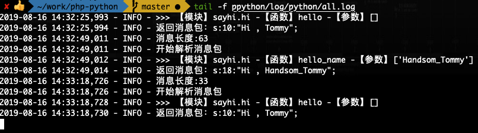
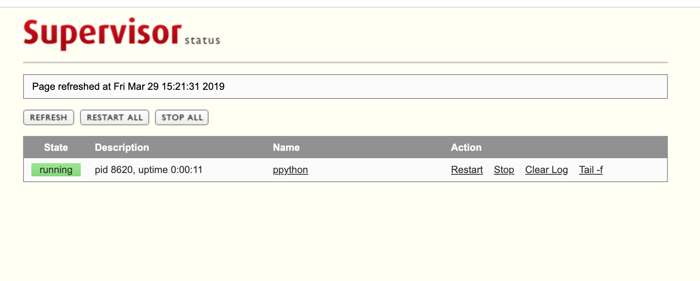

# 更新日志

* 继承指定文件夹里的模块 -- 2017-05-11
* 新增LOAD_TYPE，可以动态加载包，不需要每次都重启ppython服务 -- 2017-09-22
* 新增日志记录，脚本控制启动/重启/停止，支持supervisor管理ppython进程 -- 2019-03-29

# 令人惊喜的更新

1. 利用`ppython.sh` 来替换`screen`或`tmux`
> 请注意：这种方式和`supervisor`互斥

    # 开启ppython服务
    sh ppython/ppython.sh
    # 停止ppython服务
    sh ppython/ppython.sh stop

2. 所有重要信息都会被记录在日志里，追错/排查不再抓瞎

> 不幸的是，目前的主体日志在记录时，都会被记录两遍，请找到原因的小伙伴及时联系我！感谢~

3. 强烈建议使用`supervisor`来管理你的`ppython`服务

**supervisor简介**

C/S架构的进程控制系统，可使用户在类UNIX系统中监控、管理进程。常用于管理与某个用户或项目相关的进程。
官网地址：http://www.supervisord.org

**组成部分**

supervisord：服务守护进程
supervisorctl：命令行客户端
Web Server：提供与supervisorctl功能相当的WEB操作界面
XML-RPC Interface：XML-RPC接口

**使用方法**

* 安装`supervisor`

    ~~~
    # 注意，supervisor不支持python3，如果你默认是python3请使用pip2 isntall supervisor来安装
    pip install supervisor
    ~~~

* 修改配置文件

    ①在`supervisor/supervisord.conf`搜索 `/Users/liuzhen20/work/2019/php-python/ppython/` ，然后将这几处替换成你的`ppython`所在位置

    ②修改`supervisor/supervisord.conf`第22~25行

    ~~~
    [inet_http_server]         ; inet (TCP) server disabled by default
    port=127.0.0.1:8886        ; 这里改为你的IP地址和端口
    username=admin              ; 默认用户名
    password=admin2019               ; 默认密码
    ~~~

    ③在`supervisor/ppython.ini`搜索 `/Users/liuzhen20/work/2019/php-python/ppython/` ，然后将这几处替换成你的`ppython`所在位置

* 启动服务

    ~~~
    sh ppython/supervisord/super_update.sh
    ~~~

* 访问服务

打开上面配置的IP+端口号 http://127.0.0.1:8886

**Enjoy it!**

# 一、`ppython` 简述

> 本类库基于年久已不再维护的`ppython`改写，为了表达对它的敬意，我决定沿用原名称。

### 站在巨人的肩膀上
*********************

> `ppython`是一个令人兴奋的项目，但是已经在14年停止维护和更新。以下部分文字摘自原`ppython`介绍，原文地址 http://www.oschina.net/p/ppython

许多人在纠结`WEB`快速开发究竟是采用PHP，还是采用`Python`，二者同样是脚本语言，但特点鲜明：

**PHP:** `Web`专用开发利器，有10多年的经验积累，但其他领域基本不涉及，扩展性不强，企业应用少。

**Python:** 近期的明星语言，面向对象、简单高效、可扩展性强，但`Web`开发积累少，成熟度低。

`ppython`开源项目既是结合使用`PHP`和`Python`两种语言，取其所长、补其所短，面向企业WEB领域的开发技术。此技术可以理解为`PHP`和`Python`相结合的技术，也可称为`PHP`和`Python`混合编程技术，或者`PHP`调用`Python`服务的技术，也有人习惯称之为前台`PHP`后台`Python`的技术框架。

本项目是`LAJP`项目的语言环境的拓展，变化是将`LAJP`中的`Java`语言变更为`Python`语言，因此`LAJP`的技术、文档对本项目有参考作用。

> 特点

**优势互补:** `PHP`和`Python`都是流行的脚本语言，`PHP`非常适合网页编程；而`Python`可以当作轻量级`JAVA`，二者结合可发挥各自优势。

**高效稳定：** `Apache+PHP`组合可带来优异的`WEB`服务稳定性，而`Python`的语言能力可补充如连接池、事物管理、分布式、对象模型等高端特性。

**通信机制：** `PHP`和`Python`间的通讯方式采用`TCP Socket`和`Unix Socket`两种机制，兼顾通讯效率和分布式。

**数据类型自动转换机制：** `PHP`数据和`Python`数据可准确地自动匹配和转换，无须程序员编写解析代码。

**易用：** 安装配置简单，`PHP`端和`Python`端编程符合各自的编程习惯。

**轻量级：** 架构非常轻量级，除了最基本的`PHP`和`Python`环境，不需要任何扩充的、第三方的组件、容器。

**PHP和Python的互通：**

**提高`Python`的多线程效率**

`Python`因其语言`GIL`特性，多线程效率不高。在`PHP+Python`的混搭机制中，`Python`端可以多进程方式部署，从而提高`Python`的整体工作效率。

### 新`ppython`可以做什么？有什么优势？
*********************

**相对于已经年久失修且各种报错的旧版`ppython`，我做了相应的优化和修正，您可以很容易的集成在任意PHP项目中！**

新的`ppython`主要改进了以下内容：

* 将原生代码封装成可供调用的类库，开发者不需要关注深入的代码逻辑即可方便的使用；
* 改正了原项目中很多错误，精简了代码，去除无用代码；
* 将方法调用逻辑优化，从只传入`文件名`改为默认需传入`文件夹/文件名`，这样使开发者可以更好的管理`Python`文件；

### 注意事项
*********************

* 确保`PHP`已经打开`socket`相关模块
* 确保你的服务器上有`Python3`及以上版本

# 二、使用方法（以`ThinkPHP5`为例）

### 类库端的操作
*********************

1. 克隆代码放到`example`的`extend`目录下。

2. 在`python`目录下新建文件目录和文件，例：`test/test.py`。

3. `python`文件的基本写法和以前没有区别，其实就是将对外部访问的部分封装成方法，最终要将结果返回一个字符串或数组。

    在`test.py`中写入你要调用的方法，例：
    ~~~
	# 无参数
	def hello():
	    return 'Hi , Tommy'

	# 传递参数
	def hello_name(name):
	    return 'Hi , ' + name

	# 返回数组
	def return_arr():
	    user = {}
	    user['name'] = 'Tommy'
	    user['age']	 = 24
	    return user

	# 由于PHP传过来的参数都会被处理成字符串类型，所以需要使用数字类型的地方请自行转换，如若是其他类型数据做类似处理，否则会报错。
	# 但是由Python传给PHP的结果的数据类型不受限制
	def dosum(num1 , num2):
	    return int(num1) + int(num2)
    ~~~

4. 使用终端用`python3`运行类库下的`php_python.py`文件

	~~~
	python3 php_python.py
	~~~

	看到以下输出，证明启动成功

	~~~
	-------------------------------------------
	- PPython Service
	- Time: 2017-08-04 13:24:13
	-------------------------------------------
	Listen port: 21230
	charset: utf-8
	Server startup...
	~~~

### 在控制器中如何使用
*********************

* 头部要引用该类库

~~~
use ppython\Ppython;
~~~

* 示例代码

~~~
<?php
namespace app\index\controller;
use ppython\Ppython;

class Index
{
    // 不带参数
    public function py()
    {
	    $python = new Ppython();
	    $data = $python->py("sayhi.hi::hello");
	    dump($data);
    }

    //带参数的方法
    public function py_with_something($name)
    {
	    $python = new Ppython();
            // 更多参数依次往后添加
	    $data = $python->py("sayhi.hi::hello_name",$name);
	    dump($data);
    }

	// python返回的是数组
	public function py_arr()
	{
	    $python = new Ppython();
	    $data = $python->py("sayhi.hi::return_arr");
	    dump($data);
	}

	// PHP传递数字类型变量，计算2+3的和
	public function py_num()
	{
	    $python = new Ppython();
	    $data = $python->py("sayhi.hi::dosum",2,3);
	    dump($data);
	}
}
~~~

### 访问以查看效果
*********************

* 开启服务器，将根目录指向`example`的`public`下。

* 访问不带参数的方法
~~~
http://localhost/index/index/py
~~~

直接会得到结果

~~~
string(10) "Hi , Tommy"
~~~

* 访问带参数的方法，可以依次将参数跟在方法后面

~~~
http://localhost/index/index/py_with_something/name/Handsom_Tommy
~~~

经过`Python`处理后得到结果（多参数的情况按照说明使用即可）

~~~
string(18) "Hi , Handsom_Tommy"
~~~

* `Python`返回给`PHP`的结果不受限制，我们来测试下返回一个数组

~~~
http://localhost/index/index/py_arr
~~~

得到相应数组

~~~
array(2) {
  ["name"] => string(5) "Tommy"
  ["age"] => int(24)
}
~~~

* 由于`PHP`传过来的参数都会被处理成字符串类型，所以需要使用数字类型的地方请自行转换，如若是其他类型数据做类似处理，否则会报错。

~~~
http://localhost/index/index/py_num
~~~

得到以下结果，`Python`返回给`PHP`的数据类型不受限制

~~~
int(5)
~~~

# 三、一些必要的操作和注意事项

1. 必须使`php_python.py`一直运行着

	> 使用本类库必须进行服务器端的相关操作，其实是起`socket`服务，以支持`PHP`和`Python`之间的通信。

	**从上面已经可以看到，必须要让`php_python.py`运行着，这个类库才能正常使用，因此我们需要在服务器端进行一些必要的操作。我只提供思路和自己的解决办法，如果您有更好的解决方法，请联系我。**

	**解决方案原理：** 当我们断开`SSH`连接时，依然保持该文件的运行状态。

	利用`screen`或`tmux`这类工具运行`php_python.py`，这样我们断开`SSH`连接也没关系，它会在后台继续运行。这类工具具体使用方法请自行搜索。

    **GOOD NEWS！**

    现在支持自管理脚本/supervisor进程管理啦！详情请看最上面【令人惊喜的更新】

2. ~~如果在已有文件中添加新的代码，必须先`ctrl + c`来`shutdown`上述`php_python.py`文件，然后重新运行该文件。否则，新添加的代码不起效果。~~

	**但是，如果是新添加了目录或文件，不用进行重启操作。**

	**GOOD NEWS！**

    现在支持`LOAD_TYPE`设置啦！你可以在`process.py`里指定`LOAD_TYPE`的值。

    * 默认为0，即原有模式：如果在已有文件中添加新的代码，必须先`ctrl + c`来`shutdown`上述`php_python.py`文件，然后重新运行该文件。否则，新添加的代码不起效果。
    * 1为`reload`模式，此时可以动态加载模块，修改代码不必再重启`ppython`服务
